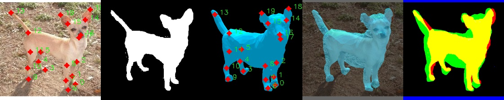

# Who Left the Dogs Out?

Evaluation and demo code for our ECCV 2020 paper: *Who Left the Dogs Out? 3D Animal Reconstruction with Expectation Maximization in the Loop*.

- [Project page](https://sites.google.com/view/wldo/home)
- [Paper](https://arxiv.org/abs/2007.11110)



## Install

Clone the repository **with submodules**:

`git clone --recurse-submodules https://github.com/benjiebob/WLDO`

### Datasets

To use the StanfordExtra dataset, you will need to download the .json file [via the repository](https://github.com/benjiebob/StanfordExtra).

You may also wish to evaluate the [Animal Pose Dataset](https://sites.google.com/view/animal-pose/). If so, download 
all of the dog images into data/animal_pose/images. For example, an image path should look like: `data/animal_pose/images/2007_000063.jpg`.<sup>1</sup>

# Quickstart

## Eval

To evaluate the performance of the model on the StanfordExtra dataset, run eval.py:

```
cd wldo_regressor
python eval.py --dataset stanford
```

You can also run on the `animal_pose` dataset

The results should read:

<table>
<th>STANFORD_EXTRA</th>
<tr><td>PCK 2D</td><td>0.82828</td></tr>
<tr><td>legs PCK 2D</td><td>0.79131</td></tr>
<tr><td>tail PCK 2D</td><td>0.74558</td></tr>
<tr><td>ears PCK 2D</td><td>0.84460</td></tr>
<tr><td>face PCK 2D</td><td>0.95583</td></tr>
<tr><td>SIL IOU 2D</td><td>0.74818</td></tr>
<tr></tr>
<th>ANIMAL_POSE</th>
<tr><td>PCK 2D</td><td>0.67580</td></tr>
<tr><td>legs PCK 2D</td><td>0.61018</td></tr>
<tr><td>tail PCK 2D</td><td>0.62745</td></tr>
<tr><td>ears PCK 2D</td><td>0.83333 </td></tr>
<tr><td>face PCK 2D</td><td>0.91111</td></tr>
<tr><td>SIL IOU 2D</td><td>0.66612</td></tr>
</table>

## Demo

To run the model on a series of images, place the images in a directory, and call the script demo.py.
To see an example of this working, run demo.py and it will use the images in `example_imgs`:

```
cd wldo_regressor
python demo.py
```

## Acknowledgements

If you make use of this code, please cite the following paper:

```
@inproceedings{biggs2020wldo,
  title={{W}ho left the dogs out?: {3D} animal reconstruction with expectation maximization in the loop},
  author={Biggs, Benjamin and Boyne, Oliver and Charles, James and Fitzgibbon, Andrew and Cipolla, Roberto},
  booktitle={ECCV},
  year={2020}
}
```


### Notes

<sup>1</sup> The eval script for animal_pose only runs on 94 of the 777 images in the dataset. This is because only these images
are provided with ground truth segmentations.

For segmentation decoding, install pycocotools
`python -m pip install "git+https://github.com/philferriere/cocoapi.git#subdirectory=PythonAPI"`
